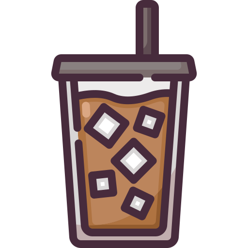

  

 

<h2 align="left">Hi there, I'm Rithika.</h2>

&nbsp;&nbsp;&nbsp;&nbsp;&nbsp;&nbsp;&nbsp;&nbsp;B.Tech in Computer Science & Engineering (AI ML) @REVA University, Bengaluru. 
&nbsp;&nbsp;&nbsp;&nbsp;&nbsp;&nbsp;&nbsp;&nbsp;Specialized in Artificial Intelligence and Machine Learning. 
&nbsp;&nbsp;&nbsp;&nbsp;&nbsp;&nbsp;&nbsp;&nbsp;Ex-Software Developer Apprentice at Target Corporation, India. 
&nbsp;&nbsp;&nbsp;&nbsp;&nbsp;&nbsp;&nbsp;&nbsp;I love a good iced coffee. 
&nbsp;&nbsp;&nbsp;&nbsp;&nbsp;&nbsp;&nbsp;&nbsp;I also love dance and music, and I'm trained in bharatanatyam. 
&nbsp;&nbsp;&nbsp;&nbsp;&nbsp;&nbsp;✨&nbsp;&nbsp;Looking for Software Developer roles. 

## Connect 📩

  &nbsp;&nbsp;&nbsp;&nbsp;
  &nbsp;&nbsp;&nbsp;&nbsp;

## My Tech Stack

	<h4> Programming Lanauges</h4>

	&nbsp;
	&nbsp;
  &nbsp;
  &nbsp;
  &nbsp;
  &nbsp;
<!--   &nbsp; -->

	<h4> Developer Tools</h4>

	&nbsp;	
<!--   &nbsp; -->
	&nbsp;

	<h4>ML Frameworks and Libraries</h4>

	&nbsp;
<!-- 	&nbsp; -->
  &nbsp;
  &nbsp;
	&nbsp;
	&nbsp;
	&nbsp;
  &nbsp;
  &nbsp;
  &nbsp;
  &nbsp;
  &nbsp;
  &nbsp;
  

 

### Github Stats
 

  

        

  

   
